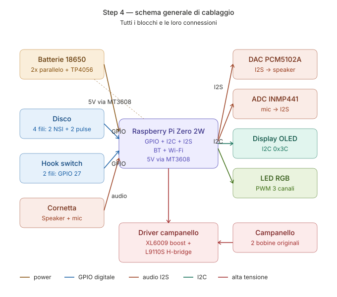

# 03 — Schema di cablaggio



## Pinout Raspberry Pi Zero 2 W

```
                    Raspberry Pi Zero 2 W
                  ┌─────────────────────┐
              3V3 │ 1  ●  ● 2  │ 5V
   I2C SDA (DISP) │ 3  ●  ● 4  │ 5V
   I2C SCL (DISP) │ 5  ●  ● 6  │ GND
       DIAL_PULSE │ 7  ●  ● 8  │ TX (debug)
              GND │ 9  ●  ● 10 │ RX (debug)
       DIAL_NSI   │ 11 ●  ● 12 │ I2S BCK
        HOOK_SW   │ 13 ●  ● 14 │ GND
        BELL_EN   │ 15 ●  ● 16 │ BELL_PH
              3V3 │ 17 ●  ● 18 │ BTN_PHONEBOOK
          (MOSI)  │ 19 ●  ● 20 │ GND
          (MISO)  │ 21 ●  ● 22 │ LED_R
          (SCLK)  │ 23 ●  ● 24 │ LED_G
              GND │ 25 ●  ● 26 │ LED_B
              ID  │ 27 ●  ● 28 │ ID
                  │ 29 ●  ● 30 │ GND
                  │ 31 ●  ● 32 │
            I2S LR│ 33 ●  ● 34 │ GND
           I2S DIN│ 35 ●  ● 36 │
                  │ 37 ●  ● 38 │ I2S DOUT
              GND │ 39 ●  ● 40 │
                  └─────────────────────┘
```

| Funzione | GPIO BCM | Pin fisico | Direzione | Note |
|----------|----------|-----------|-----------|------|
| I2C SDA (display OLED) | GPIO 2 | 3 | I/O | OLED 0x3C |
| I2C SCL (display OLED) | GPIO 3 | 5 | I/O | |
| DIAL_PULSE | GPIO 4 | 7 | IN (pull-up) | Impulsi del disco |
| DIAL_NSI | GPIO 17 | 11 | IN (pull-up) | "Off-normal" — disco in movimento |
| HOOK_SW | GPIO 27 | 13 | IN (pull-up) | LOW = cornetta sollevata |
| BELL_EN | GPIO 22 | 15 | OUT | Abilita boost 24V |
| BELL_PH | GPIO 23 | 16 | OUT | Fase H-bridge campanello (toggle 20Hz) |
| BTN_PHONEBOOK | GPIO 24 | 18 | IN (pull-up) | Pulsante rubrica |
| LED_R | GPIO 25 | 22 | OUT (PWM) | LED stato — rosso |
| LED_G | GPIO 8 | 24 | OUT (PWM) | LED stato — verde |
| LED_B | GPIO 7 | 26 | OUT (PWM) | LED stato — blu |
| I2S BCK | GPIO 18 | 12 | OUT | Bit clock audio |
| I2S LRCK | GPIO 19 | 35 | OUT | LR clock audio |
| I2S DIN | GPIO 20 | 38 | IN | Audio dal codec WM8960 (mic elettrete) |
| I2S DOUT | GPIO 21 | 40 | OUT | Audio verso codec WM8960 (speaker) |

## Cablaggio del disco combinatore

Il disco Siemens ha **due contatti** (4 fili totali):
- **NSI / "off-normal"** — chiuso quando il disco è in posizione di riposo, aperto durante la rotazione
- **Pulse / "make-break"** — apre/chiude N volte durante il ritorno (N = cifra composta)

```
            Disco combinatore Siemens
            ┌─────────────────────────┐
            │                         │
   Filo 1 ──┤ Pulse contact  ├── Filo 2
            │                         │
   Filo 3 ──┤ NSI contact    ├── Filo 4
            │                         │
            └─────────────────────────┘

Identificazione fili con multimetro (modalità continuità):
1. Disco a riposo: NSI chiuso, Pulse chiuso
2. Inizio rotazione: NSI apre
3. Ritorno: Pulse apre/chiude N volte
4. Fine: tutto torna chiuso
```

### Circuito di interfaccia disco (con debouncing HW)

```
       +3.3V
         │
        ┌┴┐
        │ │ 10kΩ pull-up
        │ │
        └┬┘
         ├──────────────────────► GPIO 4 (DIAL_PULSE)
         │
         │      ┌──┐
         ├──────┤  ├──── 100nF
         │      └──┘      ↓
         │              GND
         │
   ┌─────┤
   │     │
   │   ┌─┴─┐
   │   │   │ Contatto Pulse del disco
   │   └─┬─┘
   │     │
   └─────┴───── GND

Identico circuito per DIAL_NSI su GPIO 17.
```

**Perché il condensatore 100nF**: il contatto meccanico fa "rimbalzi" (bouncing) di ~1-2ms quando apre/chiude. Il condensatore + pull-up forma un filtro RC con τ = 10kΩ × 100nF = 1ms, che li elimina senza distorcere gli impulsi reali (durata ~50ms).

**Debouncing aggiuntivo via software** in `dial_reader.py` con `bouncetime=50` per sicurezza.

## Cablaggio hook switch (gancio cornetta)

Il gancio è un semplice interruttore meccanico già presente nel telefono. Identico al cablaggio del disco:

```
       +3.3V
         │
        10kΩ
         │
         ├────────► GPIO 27 (HOOK_SW)
         │
         │  ┌──┐
         ├──┤  ├── 100nF ── GND
         │  └──┘
         │
       hook
       switch
         │
        GND

GPIO 27 = LOW → cornetta sollevata (handset up)
GPIO 27 = HIGH → cornetta poggiata (handset down)
```

## Cablaggio audio (codec WM8960 + mic elettrete)

Un **unico codec I2S WM8960** gestisce sia l'uscita (speaker cornetta, con ampli
integrato) sia l'ingresso (mic elettrete, con bias + preamp + ADC integrati).
L'I2S è quindi **bidirezionale** verso una sola scheda.

```
                         ┌──────────────────────────┐
Pi GPIO 18 (BCK) ───────►│ BCLK                     │
Pi GPIO 19 (LRCK)───────►│ LRCLK / DACLRC / ADCLRC  │
Pi GPIO 21 (DOUT)───────►│ DACDAT   ─► SPK+ / SPK− ──┼─► Speaker cornetta (8Ω)
Pi GPIO 20 (DIN) ◄───────│ ADCDAT   ◄─ MIC+ / MIC− ◄─┼── Capsula elettrete
Pi 5V  ─────────────────►│ VDD (5V)                 │
Pi 3V3 ─────────────────►│ AVDD/DBVDD (3V3 se richiesto)
Pi GND ─────────────────►│ GND                      │
                         │   WM8960 (codec I2S)     │
                         └──────────────────────────┘
```

Note:
- Alcuni moduli WM8960 hanno un jack/header mic con **bias già fornito**: collega
  l'elettrete a `MIC+ / MIC−` (o `MIC1`), il bias lo dà il codec — niente resistore
  o op-amp esterni.
- Il **volume** di speaker e mic si regola da ALSA (`alsamixer -c wm8960soundcard`)
  e dai softvol `PhoneSoftVol` / `PhoneCaptureVol` in [`asound.conf`](../firmware/config/asound.conf),
  pilotati da `audio.speaker_gain_db` / `audio.mic_gain_db`.

### Montaggio dell'elettrete in cornetta

```
Capsula elettrete 9.7 mm  →  stessa sede della vecchia capsula a carbone
   ├─ terminale "+"  ── MIC+ del WM8960
   └─ terminale "−"  ── MIC− / GND del WM8960
```
La capsula elettrete entra nella sede meccanica Siemens praticamente identica.
Conserva la capsula a carbone originale per un eventuale ripristino.

> *Alternativa senza WM8960*: DAC PCM5102A (out) + ampli PAM8302 + mic MEMS
> digitale INMP441 (in) come tre moduli separati sull'I2S. Più componenti; il
> WM8960 è la via consigliata con l'elettrete.

## Cablaggio campanello

Vedi documento separato: [`hardware/bell_driver.md`](../hardware/bell_driver.md)

Sintesi: il campanello richiede ~24V AC a 20-25Hz. Lo generiamo con:
1. Boost DC-DC: 5V → ~30V DC
2. H-bridge (L9110S) pilotato dal GPIO 23 alla frequenza di squillo
3. GPIO 22 abilita/disabilita il boost (risparmio energia quando silente)

## Alimentazione

```
        USB-C (input ricarica)
              │
              ▼
        ┌──────────┐
        │  TP4056  │  4.2V max charge
        │  + DW01  │  + protezione
        └─────┬────┘
              │
              ▼
        ┌────────────┐
        │  2x 18650  │  3.7V nom, 7000mAh totali
        │  parallelo │
        └─────┬──────┘
              │
              ├──────────────┐
              │              │
              ▼              ▼
        ┌──────────┐   ┌──────────┐
        │ MT3608   │   │ XL6009   │
        │ 3.7→5V   │   │ 5→30V    │
        └─────┬────┘   └─────┬────┘
              │              │
              ▼              ▼
         Pi + moduli    Driver campanello
         logic (5V)     (solo quando squilla)
```

**Stima autonomia**: 
- In idle (BT advertising): ~50mA → ~140 ore (5+ giorni)
- In chiamata attiva: ~250mA → ~28 ore
- Con il display sempre acceso: scendere di ~30%

## Layout fisico interno

> 🗺️ Per la mappa "cosa togliere / tenere / aggiungere" sovrapposta a una foto
> reale della cassetta S62, vedi [`07_retrofit_layout.md`](07_retrofit_layout.md).

```
        Vista dall'alto (telefono aperto)
        
        ┌───────────────────────────────────┐
        │                                   │
        │   ┌─────────┐                     │
        │   │ Bobine  │       (campanello   │
        │   │ orig.   │        originale)   │
        │   └─────────┘                     │
        │                                   │
        │   ┌─────────────┐  ┌───────────┐  │
        │   │  PCB         │  │  18650 x2 │  │
        │   │  interfacce  │  │           │  │
        │   │  + driver    │  └───────────┘  │
        │   │  campanello  │                 │
        │   └─────────────┘                  │
        │                                    │
        │   ┌─────────────┐                  │
        │   │ Pi Zero 2W  │                  │
        │   │ + DAC I2S   │                  │
        │   └─────────────┘                  │
        │                                    │
        │     ┌────────────────────┐         │
        │     │   Disco originale  │         │
        │     └────────────────────┘         │
        │                                    │
        │   [USB-C ricarica sul retro/sotto] │
        │                                    │
        └────────────────────────────────────┘
```

Il display OLED può essere montato dietro un piccolo foro nascosto sul retro o sotto un coperchio rimovibile. Il LED RGB può essere infilato in un foro discreto sul fondo per indicare lo stato.
