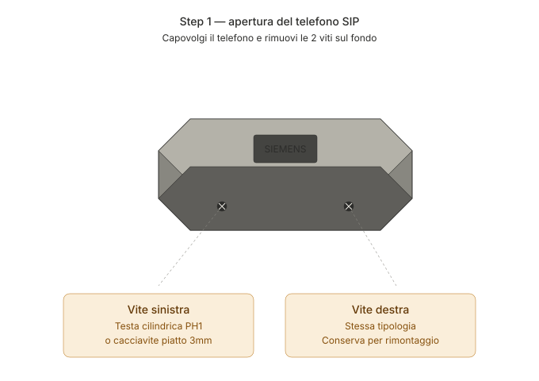
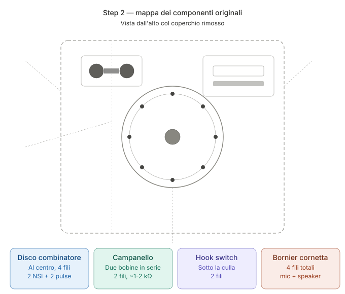
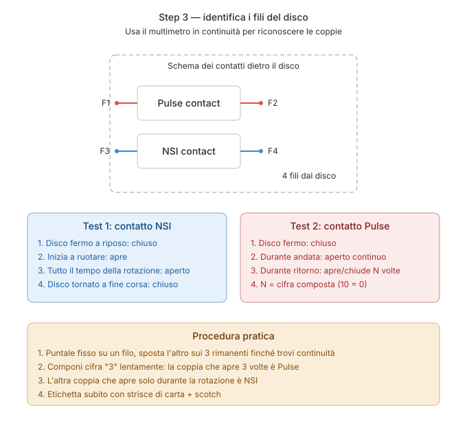
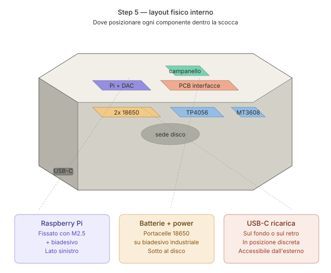
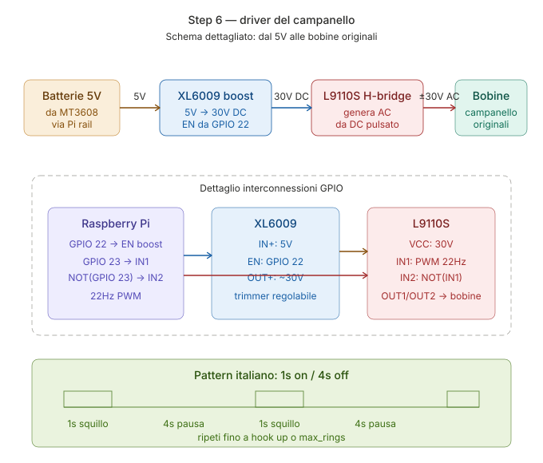
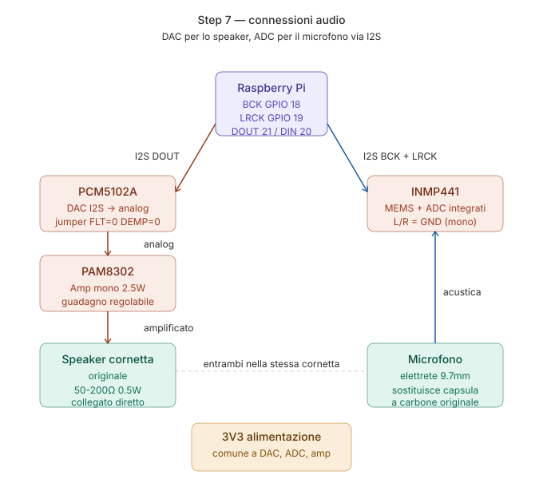
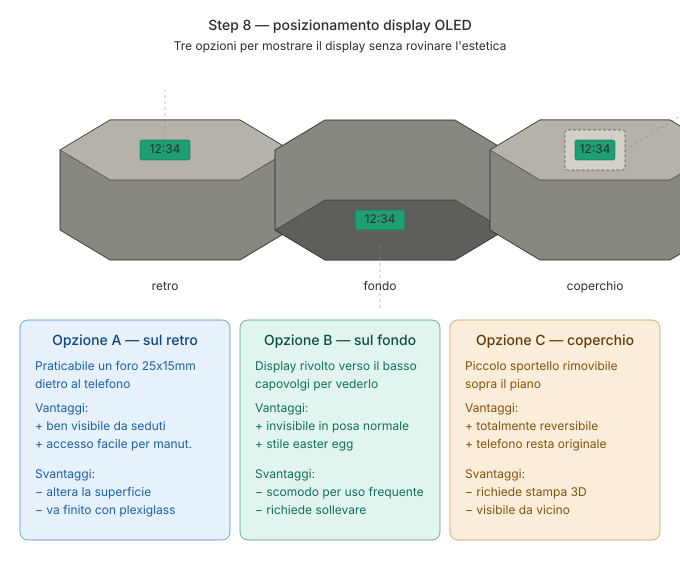

# 04 — Guida installazione hardware

## ⚠️ Prima di iniziare

1. **Fotografa tutto** prima di smontare. Soprattutto le connessioni originali del telefono.
2. **Stacca eventuali residui di linea telefonica** (se è ancora connesso a un impianto, scollegalo dalla presa).
3. **Lavora su superficie isolante** (tappeto antistatico raccomandato).
4. **Non scartare nessuna vite/molla originale** — usa scatoline etichettate.

## Step 1 — Apertura del telefono SIP



Il Siemens grigio ha tipicamente 2 viti sul fondo (testa cilindrica, dimensione PH1 o cacciavite piatto 3mm). 

1. Svita le viti sul fondo
2. Solleva il coperchio superiore con delicatezza — è incernierato sul disco
3. Identifica i componenti:
   - Disco combinatore (al centro, con due gruppi di contatti sul retro)
   - Campanello (le due bobine sotto, con il martelletto)
   - Hook switch (sotto la culla della cornetta)
   - Bornier di connessione (dove arrivano i fili della cornetta e della linea)

## Step 2 — Mappatura dei contatti originali



Usa il multimetro in modalità continuità per identificare:

### Disco combinatore (4 fili)



- Premi e tieni un puntale su un filo, scorri l'altro sui 3 rimanenti
- Trova la coppia che è **chiusa con disco fermo, aperta in rotazione** → NSI
- Trova la coppia che **apre/chiude durante il ritorno** → Pulse

Etichetta i fili con strisce di carta + scotch.

### Hook switch (2 fili)
- I contatti sotto la culla della cornetta
- Continuità invertita: chiuso = cornetta giù, aperto = cornetta su (verifica sul tuo esemplare, può variare)

### Cornetta (4 fili)
- 2 fili per il mic (di solito rossi o codificati)
- 2 fili per lo speaker (di solito neri o codificati)
- Identifica con multimetro misurando la resistenza: speaker ~50-200Ω, mic carbone ~30-300Ω a riposo

### Campanello (2 fili)
- I due capi delle bobine in serie
- Resistenza misurata: ~1-2 kΩ

## Step 3 — Pulizia e manutenzione meccanica

Prima di rimontare con l'elettronica nuova, vale la pena:
1. Pulire i contatti del disco con un panno + alcool isopropilico
2. Lubrificare leggermente le parti mobili del disco con olio leggero (orologi)
3. Pulire la cornetta esternamente e internamente con panno umido
4. Verificare che il martelletto del campanello sia libero e ben centrato

## Step 4 — Assemblaggio scheda di interfaccia

Salda su perfboard 7x9cm:
1. Resistori pull-up + condensatori per disco e hook (vedi `03_wiring.md`)
2. PAM8302 (amplificatore speaker)
3. Connettori JST-XH per i cavi modulari verso il Pi e verso i componenti originali

Crea **almeno 5 JST sul perfboard**:
- JST-2: hook switch
- JST-4: disco (pulse + NSI)
- JST-2: speaker cornetta
- JST-2: mic cornetta
- JST-2: campanello

In questo modo puoi smontare facilmente.

## Step 5 — Montaggio del Raspberry Pi



1. Salda l'header GPIO 40 pin sul Pi Zero 2 W (se non già presente)
2. Inserisci la microSD con Raspberry Pi OS Lite 64-bit già preparata (vedi `05_software_setup.md`)
3. Fissa il Pi sulla base interna del telefono con distanziali M2.5 + biadesivo industriale
4. Cabla con jumper female-female o piccola scheda di interconnessione

## Step 6 — Montaggio alimentazione

1. Cablaggio TP4056:
   ```
   USB-C (input)  → IN+ / IN-
   B+ / B-        → portacelle 18650
   OUT+ / OUT-    → ingresso MT3608
   ```
2. Regola il MT3608 a 5.0V **PRIMA** di collegarlo al Pi (girare il trimmer con un mini cacciavite mentre misuri con multimetro)
3. Fissa il portacelle 18650 sul fondo del telefono con biadesivo industriale
4. Porta il connettore USB-C sul retro/sotto del telefono, in una posizione discreta

## Step 7 — Driver campanello



Segui [`hardware/bell_driver.md`](../hardware/bell_driver.md).

Test funzionamento PRIMA di rimontare tutto:
1. Connetti il driver al campanello originale
2. Controlla manualmente con script di test (`firmware/src/bell_driver.py` ha un main di test)
3. Aspettati ~60-70 dB a 30cm di distanza — è forte ma autentico!

## Step 8 — Audio cornetta



### Opzione A — Mic a carbone originale (autentico)
1. Connetti i fili del mic al circuito di bias + preamp sulla perfboard
2. Output del preamp → ingresso analogico di un ADC esterno → I2S al Pi
3. Questa opzione richiede un modulo aggiuntivo come WM8960 (HAT audio I2S con codec completo)

### Opzione B — INMP441 al posto del mic originale (semplice)
1. Smonta la capsula a carbone (di solito si svita o si estrae)
2. Pratica supporto stampato 3D o adatta il modulo INMP441 nella sede originale
3. Connetti via I2S direttamente al Pi
4. Conserva la capsula originale per ripristino futuro

**Per lo speaker**: lo speaker originale è quasi sempre 50-200Ω. Connettilo direttamente all'uscita del PAM8302 — funziona benissimo, non serve adattamento.

## Step 9 — Display OLED (opzionale)



Possibili posizionamenti:
- **Sotto un coperchio rimovibile** sul retro del telefono — si vede solo quando vuoi
- **Dietro un piccolo foro discreto** sulla base, coperto da plexiglass scuro
- **Nel fondo, visibile solo capovolgendo il telefono** — soluzione "easter egg"

Cablaggio I2C:
```
Pi 3V3 ──► VCC display
Pi GND ──► GND display
Pi GPIO 2 (SDA) ──► SDA display
Pi GPIO 3 (SCL) ──► SCL display
```

## Step 10 — Test prima della chiusura

Prima di rimontare il coperchio, testa **tutto**:

```bash
cd ~/vintage_tel_bl/firmware
python3 -m src.test_hardware
```

Lo script `test_hardware.py` esegue:
1. Test LED RGB (ciclo colori)
2. Test display OLED (mostra "VINTAGE TEL BL OK")
3. Test hook switch (mostra stato in tempo reale)
4. Test disco (mostra cifre composte)
5. Test campanello (3 squilli brevi)
6. Test audio loopback (registra 2 sec dal mic, riproduce sullo speaker)

Solo se tutti i 6 test passano, procedi al rimontaggio finale.

## Step 11 — Rimontaggio finale

1. Sistema tutti i cavi con fascette adesive interne
2. Verifica che nessun cavo interferisca con il martelletto del campanello
3. Verifica che il disco giri liberamente
4. Chiudi il coperchio
5. Avvita le viti del fondo
6. Carica la batteria via USB-C fino a fine ciclo (LED TP4056 da rosso a verde)

🎉 Sei pronto!
