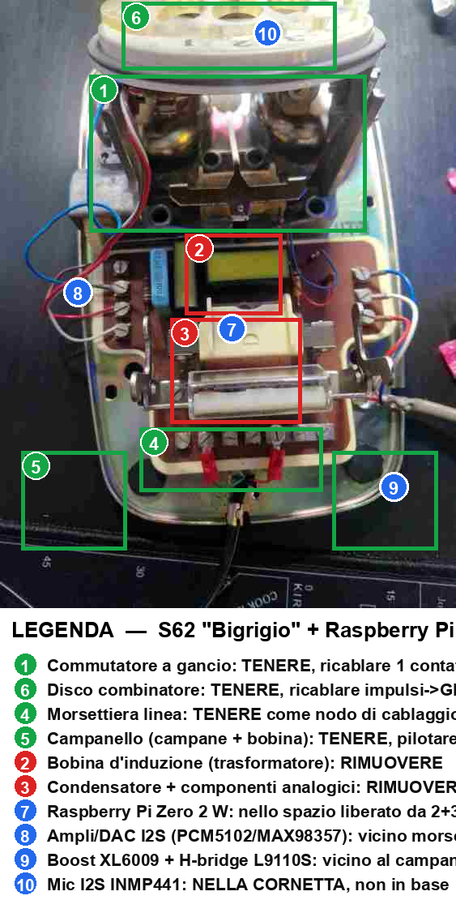

# 07 — Mappa di conversione della cassetta

Da consultare **dopo** l'apertura del telefono (Step 1–2 di
[`04_installation.md`](04_installation.md)) e **prima** di rimuovere qualcosa:
cosa togliere, cosa tenere e dove sistemare i componenti nuovi.

Vista più chiara (stesso modello, angolazione diversa) con gli stessi numeri:

> 🟩 verde = tenere · 🟥 rosso = rimuovere · 🟦 blu = nuovo.
> Le posizioni dei marker sono **indicative**: verifica sempre sul tuo esemplare.

Versione **schematica** pulita (stessa numerazione 1–10), comoda come riferimento
rapido: [`../assets/diagrams/09_conversion_map.svg`](../assets/diagrams/09_conversion_map.svg).

## In breve

| Azione | Componenti | Note |
|--------|-----------|------|
| **Tieni** | Disco combinatore, commutatore a gancio, campanello (campane + bobina), morsettiera, altoparlante cornetta | Da ricablare verso il Pi (vedi [`03_wiring.md`](03_wiring.md)) |
| **Rimuovi** | Bobina d'induzione (trasformatore), condensatore + rete analogica (resistori/varistore) | Era il circuito fonia analogico, ora sostituito da Pi + I2S |
| **Aggiungi** | Raspberry Pi Zero 2 W, ampli MAX98357A, boost + H-bridge campanello, mic SPH0645 (in cornetta) | Il Pi va nello spazio centrale liberato |

## Mappatura completa

Tabelle dettagliate (terminali dello schema S62, valori, GPIO) e identificazione
dei contatti col multimetro: vedi [`../hardware/retrofit_layout.md`](../hardware/retrofit_layout.md).

| # | Tieni / Rimuovi / Aggiungi | Componente | GPIO |
|---|----------------------------|-----------|------|
| 1 | Tieni | Commutatore a gancio | GPIO 27 |
| 6 | Tieni | Disco combinatore (impulsi + NSI) | GPIO 4 / GPIO 17 |
| 5 | Tieni | Campanello (bobina ≈ 1700 Ω) | GPIO 22 / GPIO 23 |
| 4 | Tieni | Morsettiera (nodo di cablaggio) | — |
| 2 | Rimuovi | Bobina d'induzione / trasformatore | — |
| 3 | Rimuovi | Condensatore + rete analogica | — |
| 7 | Aggiungi | Raspberry Pi Zero 2 W (zona centrale) | — |
| 8 | Aggiungi | Ampli MAX98357A (vicino auricolare) | I2S |
| 9 | Aggiungi | Boost + H-bridge (vicino campanello) | — |
| 10 | Aggiungi | Mic MEMS SPH0645 (nella cornetta) | I2S |

## Procedura consigliata (l'ordine conta)

Idea di fondo: **prima svuoti** la fascia centrale (parti analogiche), **poi
popoli** lo spazio col Pi, cablando e collaudando **un sottosistema alla volta**.
I numeri rimandano ai marker dell'immagine; gli Step a [`04_installation.md`](04_installation.md).

### Fase A — Smontaggio (sicuro, reversibile)

0. **Fotografa ed etichetta** tutti i fili prima di staccare (04 · Step 1–2).
1. Assicurati che il telefono **non sia collegato alla linea**; nessuna tensione presente.
2. Rimuovi **③ condensatore + rete analogica** (resistori/varistore): annota i fili, poi dissalda/scollega.
3. Rimuovi **② bobina d'induzione (trasformatore)**.
4. Scollega il **⑤ campanello dalla linea** (lascia bobina e campane in sede): i due capi della bobina andranno all'H-bridge.
5. **Isola i contatti** di **① gancio** e **⑥ disco** che userai; scollega il resto dal circuito originale.

➡️ Risultato: nello chassis restano solo **disco, gancio, campanello, morsettiera**; la fascia centrale è libera.

### Fase B — Montaggio (un blocco alla volta, con collaudo)

| Ordine | Monta | Cabla | Verifica |
|--------|-------|-------|----------|
| 1 | **⑦ Raspberry Pi** nello spazio centrale | alimentazione 5V | il Pi avvia Raspberry Pi OS |
| 2 | segnali a bassa tensione | ① gancio→GPIO27, ⑥ impulsi→GPIO4, NSI→GPIO17 (RC come da [`03_wiring.md`](03_wiring.md)) | `python -m src.test_hardware --monitor` (gancio + cifre) |
| 3 | **⑩ mic SPH0645** in cornetta + **⑧ ampli MAX98357A** | bus I2S | test audio loopback |
| 4 | **⑨ boost + H-bridge** | bobina **⑤ campanello** | test campanello (3 squilli) |
| 5 | alimentazione (batteria/USB-C) + display/LED opzionali | — | LED stato, OLED |
| 6 | — | — | **`python -m src.test_hardware`** (tutti i 6 test) |
| 7 | chiusura | fascette; verifica che i cavi non tocchino il martelletto | il disco gira libero |

> Collauda **prima** di richiudere il coperchio (04 · Step 10): rilavorare a cassetta aperta costa molto meno.

## Materiale di riferimento

- Schema originale Siemens S62: [`../assets/retrofit/s62_schema.jpg`](../assets/retrofit/s62_schema.jpg)
- Foto cassetta smontata: [`../assets/retrofit/cassetta_smontata.jpg`](../assets/retrofit/cassetta_smontata.jpg)
- Mappa tecnica completa: [`../hardware/retrofit_layout.md`](../hardware/retrofit_layout.md)
